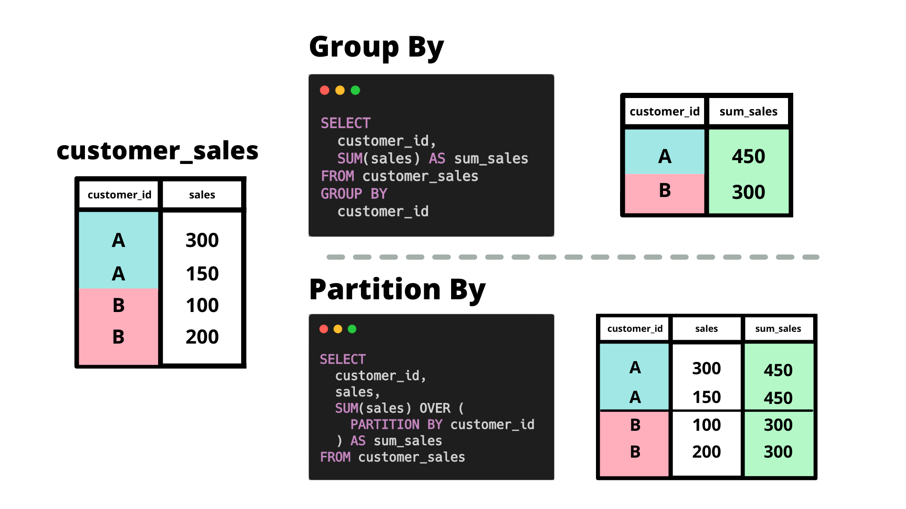

### Window Functions
---

`Definition` : Window functions are operations/calculations applied on "window frames" or group of row in a dataset. 

- **Window Function Components** 


- **Difference between `GROUP BY` and `PARTITION BY` clause** 




- **SQL Logical Execuation Order** 

>`FROM` 

>>`WHERE` filter 

>> `ON` table join conditions 

>`GROUP BY`

>`SELECT`  aggregate function calculations

> `HAVING`

> window functions 

> `ORDER BY`

>`LIMIT`


__Some important points__

-  With `HAVING` clause we can only use columns present in `GROUP BY` or some aggregation function on top of group by columns. 

- `RANDOM()` function - Sample a fraction of dataset randomly 

```sql
SELECT col_1, 
       ... 
       col_n 
FROM schema_name.table_name 
WHERE RANDOM() <= fraction -- fraction value lies between 0 & 1 
```

- 

