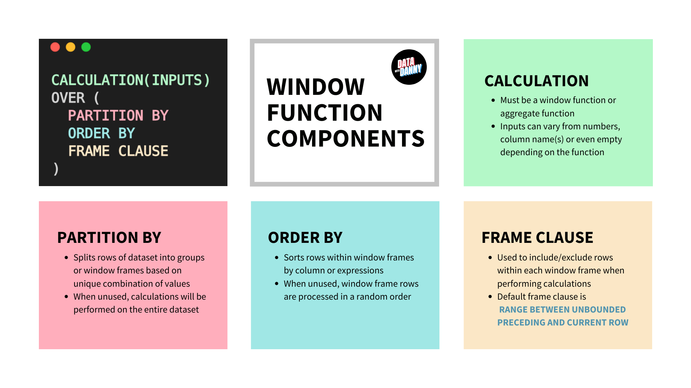

### Window Functions
---

`Definition` : Window functions are operations/calculations applied on "window frames" or group of row in a dataset. 

- **Window Function Components** 



- **Difference between `GROUP BY` and `PARTITION BY` clause** 


- **SQL Logical Execuation Order** 

>`FROM` 

>>`WHERE` filter 

>> `ON` table join conditions 

>`GROUP BY`

>`SELECT`  aggregate function calculations

> `HAVING`

> window functions 

> `ORDER BY`

>`LIMIT`


__Some important points__

-  With `HAVING` clause we can only use columns present in `GROUP BY` or some aggregation function on top of group by columns. 

- `RANDOM()` function - Sample a fraction of dataset randomly 

```sql
SELECT col_1, 
       ... 
       col_n 
FROM schema_name.table_name 
WHERE RANDOM() <= fraction -- fraction value lies between 0 & 1 
```

- POPULAR Window Functions : `RAW_NUMBER()` , `RANK()`, `DENSE_RANK()` , `CUME_DIST()`, `PERCENT_RANK()`, `NTILE(<INTEGER>)`

- Identify rows with `NULL` values : using concept called propagation of null which is adding a numeric to null will give back null. 

```sql
select col_1, ..., col_n 
from schema_name.table_name 
where col_1 + ... + col_n is NULL -- If any column is null in a row then return that row. 
```

- `LEAD` and `LAG` window function 
  - both accepts 3 arguments ( <column-name>, optional offset parameter with default value 1 , optional **default** (with default value `null`) whose datatype should be same as column-name)
  - LEAD function places value of next row of col_lead in current row and if next row not available then replaces it by default 
  - LAG function places value of previous row of col_lag in current row and if prev row not available uses default value instead. 

```sql
SELECT col_1, 
       LAG(col_lag) OVER ( ORDER BY col_order_by  ) AS lag_values 
       LEAD(col_lead) OVER ( ORDER BY col_order_by ) AS lead_values 

FROM schema_name.table_name 
```

- `COALESCE` window function 

```sql
select coalesce( col_1, ..., col_n ) -- return value of first column while searching from left to right s.t. it is not null.  
from schema_name.table_name 
```

- `DELETE` and `INSERT` 

```sql
DELETE FROM table_name 
WHERE condition_statments
RETURNING * --- optional if your want to see what rows are deleted 

INSERT INTO table_name 
<generate a table-output using select _ from type statment>
RETURNING * -- optional if you want to see what rows are added 
```

- Frame Clause in Window Functions


