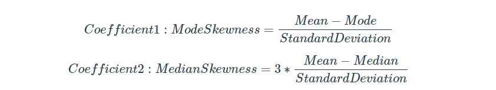

#### Exercies - Statistics 101 

- What is the average, median and mode values of blood glucose values to 2 decimal places?

```sql
SELECT
  'blood_glucose' as measure ,
  ROUND( AVG(measure_value), 2) AS mean_value ,
  ROUND( MODE() WITHIN GROUP (ORDER BY measure_value),2)  AS mode,
  ROUND( CAST( PERCENTILE_CONT(0.5) WITHIN GROUP (ORDER BY measure_value) AS NUMERIC ) , 2 ) AS median 
FROM
  health.user_logs
WHERE 
  measure = 'blood_glucose';
```

- What is the most frequently occuring `measure_value` value for all blood glucose measurements?

```sql
SELECT measure_value, COUNT(*) AS frequency 
FROM health.user_logs 
WHERE measure = 'blood_glucose'
GROUP BY measure_value 
ORDER BY frequency DESC
LIMIT 10; 
```

notice : topmost value is equal to mode value . it need not be equal to mode value 


- Calculate the 2 Pearson Coefficient of Skewness for blood glucose measures given the below formulas




```sql
WITH mean_mode_median_std AS (
  SELECT
    ROUND(AVG(measure_value), 2) AS mean_value,
    ROUND(
      MODE() WITHIN GROUP (
        ORDER BY
          measure_value
      ),
      2
    ) AS mode,
    ROUND(
      CAST(
        PERCENTILE_CONT(0.5) WITHIN GROUP (
          ORDER BY
            measure_value
        ) AS NUMERIC
      ),
      2
    ) AS median,
    ROUND(STDDEV(measure_value), 2) AS std_deviation
  FROM
    health.user_logs
  WHERE
    measure = 'blood_glucose'
)
SELECT
  (mean_value - mode) / std_deviation AS mode_skewness,
  3 *(mean_value - median) / std_deviation AS median_skewness
FROM
  mean_mode_median_std
```


