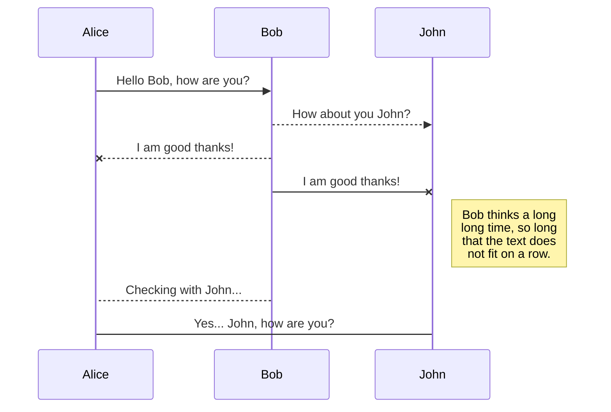
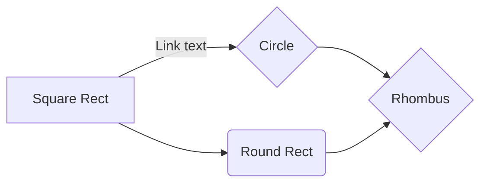

### 2.2.1. This is a level 3 heading

There are also single and double hashtag titles for level 1 and 2 - but I wanted to keep my table of contents for this tutorial clean and tidy :)

You can also type some text here.

This is how you do something in **bold** or _italics_

Then you can make a list of bullet points:

* 1, 2, 3
* A, B, C
* what about an indented bullet?
  + as easy as it gets!

1. What if you want numbered lists?
2. As easy as this!

We can also add images using a few methods as long as the file is in the right path!


Finally - we can add code chunks like so to have SQL syntax highlighting turned on:

```sql
SELECT * FROM some_table
```

Or you can have code in-line like this `SELECT * FROM some_table` but the syntax highlighting won't on for these in-line code snippets.

If you want to highlight something you can also use blockquotes:

> Something you really want to emphasise

You can also do page breaks using three underscores together like below to slightly separate sections of your document

---

Finally we can also include external links to websites like [https://www.google.com]


---
Some more markdowns : 
| | ASCII | HTML|
|-|-|-|
|Single backticks|`'Isn't this fun?'`|'Isn't this fun?'|
|Quotes          |`"Isn't this fun?"`            |"Isn't this fun?"            |
|Dashes          |`-- is en-dash, --- is em-dash`|-- is en-dash, --- is em-dash|


## KaTeX

You can render LaTeX mathematical expressions using [KaTeX](https://khan.github.io/KaTeX/):

The *Gamma function* satisfying $\Gamma(n) = (n-1)!\quad\forall n\in\mathbb N$ is via the Euler integral

$$
\Gamma(z) = \int_1^\infty t^{z-1}e^{-t}dt\,.
$$


## UML diagrams

You can render UML diagrams using [Mermaid](https://mermaidjs.github.io/). For example, this will produce a sequence diagram:



And this will produce a flow chart:




# Two ways to bold text 

**bold** is gold . It works without spaces too like**This**

__bold__ is gold forever. It doesn't work without spaces like__this__ . 

[hobbit-hole][1]

<!-- [1]: https://en.wikipedia.org/wiki/Hobbit#Lifestyle -->
<!-- [1]: https://en.wikipedia.org/wiki/Hobbit#Lifestyle "Hobbit lifestyles" -->
[1]: https://en.wikipedia.org/wiki/Hobbit#Lifestyle 'Hobbit lifestyles'
<!-- [1]: https://en.wikipedia.org/wiki/Hobbit#Lifestyle (Hobbit lifestyles) -->
<!-- [1]: <https://en.wikipedia.org/wiki/Hobbit#Lifestyle> "Hobbit lifestyles" -->
<!-- [1]: <https://en.wikipedia.org/wiki/Hobbit#Lifestyle> 'Hobbit lifestyles' -->
<!-- [1]: <https://en.wikipedia.org/wiki/Hobbit#Lifestyle> (Hobbit lifestyles) -->


<!-- All above methods are equivalent  -->


- [x] I am back 
- [ ] I am not back 

gone camping tent! :tent: be back soon. 
This is so funny :joy:


`http://www.example.com`