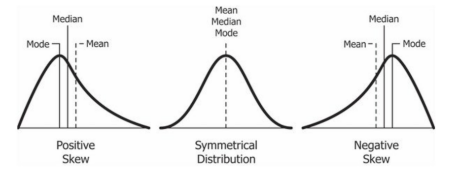

#### Statistics 101 

Statistics is full of "threshold-concepts" i.e. Once you really understood something you won't forget therm EVER !!! 

**Central Location Statistics**

*1. Arithmic Mean or Average* 

$ \mu = \frac{\sum X_{i}}{N}$

```sql
SELECT AVG(numerical_colum) AS Mean
FROM schema_name.table_name; 
```

*2 Median* 
sort all values in ascending order and find middle value . if **N** is odd , median is average of two middle values. In statistics median is called 50th percentile for some reason!

```sql
SELECT
  PERCENTILE_CONT(0.5) WITHIN GROUP (
    ORDER BY
      numeric_column
  ) AS Median
FROM
  schema_name.table_name;
```
**Note** *`ROUND` function doesn't work on `FLOAT` i.e. `DOUBLE PRECISION` data type and `PERCENTILE_CONT` returns `FLOAT` so don't forget to cast its output to `NUMERIC` before futher processing.*

```sql
SELECT
  CAST(
    PERCENTILE_CONT(0.5) WITHIN GROUP (
      ORDER BY
        numeric_column
    ) AS NUMERIC
  ) AS Median
FROM
  schema_name.table_name;
```


*3 Mode* 
Most occuring value. There can be more than one mode value(s). 

```sql
SELECT
  MODE() WITHIN GROUP (
    ORDER BY
      column_name
  ) AS Mode
FROM
  schema_name.table_name;
```

**Spread of Data**

*1. `MIN`, `MAX` & Rangle*

```sql
EXPLAIN ANALYZE
SELECT
  MIN(numeric_column) AS minimum_value,
  MAX(numeric_column) AS maximum_value,
  MAX(numeric_column) - MIN(numeric_column) AS range_value
FROM schema_name.table_name;
```

**Note** To analyse the running time and other details of query type `EXPLAIN ANALYZE` like I did in above syntax . 

*2. `VARIANCE` and `STDDEV`*  

```sql
SELECT 
  ROUND( VARIANCE(numeric_column) , 2 ) AS Variance 
  ROUND( STDDEV(numeric_column), 2 ) AS Standard_Deviation
FROM 
 schema_name.table_name;
```

*Formula*

Variance $ \sigma^2  = \sum_{i=1}^{N} \frac{(X_i - \mu)^2}{N} $
Standard Deviation = $ \sigma $ 

*Interpretation*

* Variance gives the spread of values around mean of given dataset. 

*Empirical Rule or Confidence Interval*

For normal distribution ( bell shaped curves) approximate distribution of data is as follows  
$ \mu \pm \sigma  \approx 68 \% $ 
$\mu \pm 2\sigma \approx 95 \% $
$\mu \pm 3\sigma \approx 99.7 \% $


*3. Skewness* 

<br>


But we haven't answered one important question, WHAT this all tell us REALLY? ( hint - Read next tutorial :smile:)

This is all for now. 


